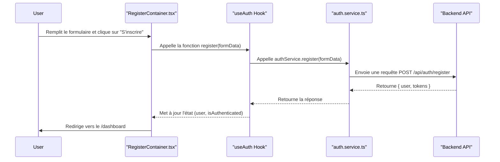

## Gestion des erreurs côté Frontend

L'application frontend gère les erreurs API et d'exécution de manière centralisée pour offrir une expérience utilisateur claire et cohérente.

### 1. Erreurs API (issues du backend)
- Les réponses d'erreur structurées du backend (voir README backend) sont interceptées par les services API (ex: `auth.service.ts`).
- Les messages d'erreur sont extraits et affichés dans l'UI (formulaires, notifications, etc.).
- Les erreurs de validation sont affichées champ par champ si possible.

**Exemple de gestion dans un formulaire :**
```js
try {
  await authService.login(email, password);
} catch (error) {
  // error.response.data.message ou error.response.data.errors
  setError(error.response?.data?.message || 'Erreur inconnue');
  // Pour les erreurs de validation :
  if (error.response?.data?.errors) {
    error.response.data.errors.forEach(e => setFieldError(e.field, e.message));
  }
}
```

### 2. Erreurs de rendu React
- Un composant `ErrorBoundary` est utilisé pour capturer les erreurs inattendues de rendu et afficher un message d'erreur global.
- Cela évite le crash complet de l'application en cas d'erreur JavaScript.

### 3. Notifications et feedback utilisateur
- Les erreurs sont affichées via des composants de notification, des alertes ou des messages sous les champs de formulaire.
- Les erreurs critiques peuvent déclencher des toasts ou des modales pour attirer l'attention de l'utilisateur.

### 4. Bonnes pratiques
- Toujours afficher un message clair et actionnable à l'utilisateur.
- Ne jamais exposer de détails techniques ou de stack trace en production.
- Logger les erreurs critiques côté client pour analyse (optionnel).

> Pour plus de détails sur la structure des erreurs API, voir le README du backend. 

## Flux d'Authentification

### Flux d'Inscription (Frontend)



## Modules partagés

### Module `common`

La documentation complète des composants et utilitaires partagés se trouve dans :

[frontend/src/modules/common/README.md](src/modules/common/README.md)

Vous y trouverez :
- La structure du module
- L'utilisation détaillée de chaque composant (ErrorBoundary, LoadingSpinner, DataTable, etc.)
- Des exemples d'utilisation concrets
- Les bonnes pratiques pour la contribution 

## Documentation interactive des composants UI

L'ensemble des composants partagés et UI sont documentés et visualisables via Storybook.

- Pour lancer Storybook en local :

```bash
cd frontend
npm run storybook
```

- Accès : http://localhost:6006

Les stories couvrent tous les composants principaux du module `common` et des UI de base. Pour contribuer, ajoutez une story dans le dossier du composant concerné. 